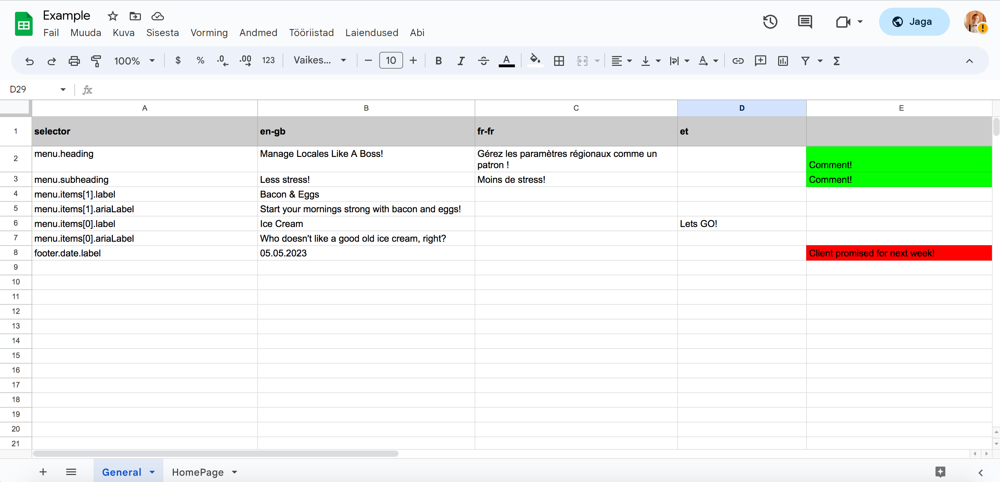

# Google Sheets to Locales

[](https://opensource.org/licenses/MIT)



This Node.js module fetches data from a Google Sheets spreadsheet and generates locale JSON files. It is useful for managing translations or localization content in a Google Sheets document and exporting it to JSON files for use in your application.

## Prerequisites

Before you begin, make sure you have the following:

- [Node.js](https://nodejs.org/) installed
- A [Google Sheets API key](https://developers.google.com/sheets/api/guides/authorizing#APIKey)

## Installation

1. Clone the repository or download the source code:

```bash
git clone https://github.com/Jaakal/google-sheets-to-locales.git
```

2. Navigate to the project directory:

```bash
cd google-sheets-to-locales
```

3. Install the dependencies:

```bash
npm install
```

## Configuration

1. Open the main script file (e.g., `index.js`) and set the `apiKey`, `spreadsheetId`, and `outputDirectory` variables to your Google Sheets API key, the ID of your spreadsheet, and the desired output directory for the generated JSON files, respectively.

2. Make sure your Google Sheets document is properly formatted. The first row should contain locale codes (e.g., "en", "fr", "es") starting from second column, and the following rows should contain in the first column the keys and translations in the following columns. Each sheet within the document represents a separate namespace. Columns after the locale columns can be used for comments.

## Usage

To fetch data from your Google Sheets document and generate locale JSON files, run the following command in your project directory:

```bash
node index.js
```

This will create JSON files for each locale in the specified output directory.

## License

This project is licensed under the terms of the MIT license. See the [LICENSE](LICENSE) file for details.
